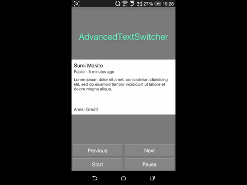

# AdvancedTextSwitcher

Advanced TextSwitcher for faster development.

Just like the way how Google+ display recent reviews on their cards.

仿照Google+在卡片上滚动显示最新评论的TextSwitcher。

### Preview 预览



[Watch Preview on Youtube](https://youtu.be/6RBXKVVwF7I)

### Add to your project 添加到你的项目

Add JitPack repository to build.gradle in project root.

在项目根目录下的build.gradle中加入以下内容

```
allprojects {
	repositories {
		...
		maven { url "https://jitpack.io" }
	}
}
```

Add the dependency to build.gradle in app root.

在应用目录下的build.gradle中加入以下依赖

```
dependencies {
        compile 'com.github.SumiMakito:AdvancedTextSwitcher:0.1'
}
```

You can also add this project as a library to your project directly.(NOT recommended)

### Usage 使用说明

##### Import 导入

```java
import sumimakito.android.advtextswitcher.*;
```

##### Add Widget in XML 在XML中加入控件

```xml
<sumimakito.android.advtextswitcher.AdvTextSwitcher
		xmlns:app="http://schemas.android.com/apk/res/sumimakito.android.advtextswitcher"
		android:id="@+id/advTextSwitcher"
		android:textColor="#66BCBB"
		android:layout_width="match_parent"
		android:layout_height="wrap_content"
		app:textSize="32sp"
		app:gravity="center"
		app:inAnim="@android:anim/slide_in_left"
		app:outAnim="@android:anim/slide_out_right" />
```

###### Attributes 属性

+ xmlns:app (Don't forget to copy the xmlns:app line.)
+ android:textColor Text color.
+ app:textSize Text size.
+ app:gravity Gravity for each text.(Only support center/left/right, CENTER_VERTICAL is automatically applied.)
+ app:inAnim/outAnim (Optional) Specify anim resources.

##### Attach AdvTextSwitcher in Java 在Java代码中调用

```java
    //For example, the String array below contains four recent reviews.
    String[] texts = {"Anne: Great!", "Cathy: I do not think so.", "Jimmy: Cloning your repo...", "Aoi: This bug disappeared!"};
    advTextSwitcher = (AdvTextSwitcher) findViewById(R.id.advTextSwitcher);
    //Give them to AdvTextSwitcher
    advTextSwitcher.setTexts(texts);
    //Manually switch to the next text in the String array.
    advTextSwitcher.next();
    //Switch to the previous one.
    advTextSwitcher.previous();

    //Auto switch between texts every 5000ms.
    Switcher switcher = new Switcher(advTextSwitcher, 5000);
    switcher.start();
    //Pause
    switcher.pause();
    //Or use switcher in only one line...
    new Switcher().attach(advTextSwitcher).setDuration(5000).start();

    //Want to know which text is clicked?
    advTextSwitcher.setCallback(new AdvTextSwitcher.Callback(){
			    	@Override
		    		public void onItemClick(int position)
	    			{
		    		    Toast.makeText(MainActivity.this, "ITEM@"+position+" Clicked!", Toast.LENGTH_SHORT).show();
		    		}
    });
```
### Donate &amp; Support 捐赠与支持

Makito是一个自由开发者，同时也是一名在校大学生。

若是我的项目曾为您带来便利，我将很开心。

您可以收藏我的其他优秀项目以表示支持，也可以通过支付宝向我打赏以示鼓励，我将记住每一个曾支持过以及帮助过我的人，谢谢。

支付宝账户 826257232#qq.com (#请换成@)

或使用支付宝客户端扫描下面的二维码


### Copyright &amp; License 版权信息与授权协议

Copyright &copy; 2014-2015 Sumi Makito

Licensed under Apache License 2.0 License.

```
Copyright 2014-2015 Sumi Makito

Licensed under the Apache License, Version 2.0 (the "License");
you may not use this file except in compliance with the License.
You may obtain a copy of the License at

    http://www.apache.org/licenses/LICENSE-2.0

Unless required by applicable law or agreed to in writing, software
distributed under the License is distributed on an "AS IS" BASIS,
WITHOUT WARRANTIES OR CONDITIONS OF ANY KIND, either express or implied.
See the License for the specific language governing permissions and
limitations under the License.
```
